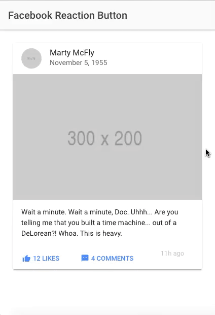

# Ionic-Facebook-Reactions-Button

This project is an example created in the [Josh Morony Blog](https://www.joshmorony.com/creating-a-facebook-style-reaction-button-in-ionic/) that have been modified by me.



* Test in localhost:

To run it, cd into `ionic-media-app-vod-accedo` and run:

```bash
npm install
ionic serve
```

* Test in Android: 

```bash
ionic cordova add platform android
ionic cordova run android
```

* Test in iOS: 

```bash
ionic cordova add platform ios
ionic cordova run ios
```

## Requirements

* [Node.js](http://nodejs.org/)
* [Ionic](https://ionicframework.com/getting-started/)

## License
   
The MIT License (MIT) Copyright (c)

Permission is hereby granted, free of charge, to any person obtaining a copy of this software and associated documentation files (the "Software"), to deal in the Software without restriction, including without limitation the rights to use, copy, modify, merge, publish, distribute, sublicense, and/or sell copies of the Software, and to permit persons to whom the Software is furnished to do so, subject to the following conditions:

The above copyright notice and this permission notice shall be included in all copies or substantial portions of the Software.

THE SOFTWARE IS PROVIDED "AS IS", WITHOUT WARRANTY OF ANY KIND, EXPRESS OR IMPLIED, INCLUDING BUT NOT LIMITED TO THE WARRANTIES OF MERCHANTABILITY, FITNESS FOR A PARTICULAR PURPOSE AND NONINFRINGEMENT. IN NO EVENT SHALL THE AUTHORS OR COPYRIGHT HOLDERS BE LIABLE FOR ANY CLAIM, DAMAGES OR OTHER LIABILITY, WHETHER IN AN ACTION OF CONTRACT, TORT OR OTHERWISE, ARISING FROM, OUT OF OR IN CONNECTION WITH THE SOFTWARE OR THE USE OR OTHER DEALINGS IN THE SOFTWARE.
   
Original work Copyright (c) 2017 Josh Morony
Modified work Copyright (c) 2017 Adrián Brito